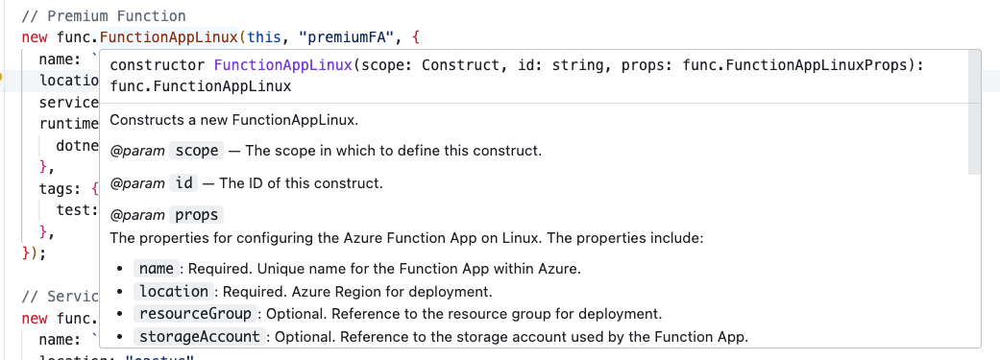

# Documentation
Terraform [documentation](https://registry.terraform.io/modules/Azure/vnet/azurerm/latest?tab=inputs) usually requires some sort of reference documentation on the terraform registry:

This requires knowing how to find the documentation and a lot of back and forth to figure out what you can do to use the module.

## Documentation in CDK

In Terraform CDK, the developer can see the properties used for each resource directly within the IDE, no context switching:
