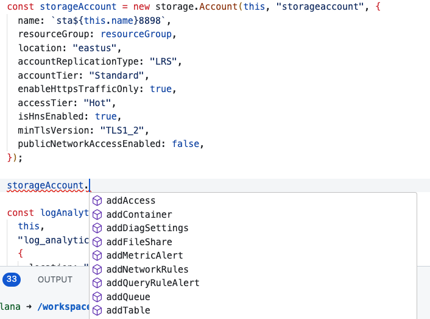

# Object Oriented Design

In the HCL example, resources are declared in a linear, declarative manner. This approach is straightforward but can be verbose, especially as infrastructure complexity grows. Developers often need to refer to documentation for each resource type to understand available properties and their dependencies. The structure, while clear, doesn't inherently guide the developer through the process of creating dependent resources or configuring complex systems.

```hcl
resource "azurerm_resource_group" "example" {
  name     = "example-resources"
  location = "West Europe"
}

resource "azurerm_storage_account" "example" {
  name                     = "examplestoracc"
  resource_group_name      = azurerm_resource_group.example.name
  location                 = azurerm_resource_group.example.location
  account_tier             = "Standard"
  account_replication_type = "LRS"
}

resource "azurerm_storage_container" "example" {
  name                  = "content"
  storage_account_name  = azurerm_storage_account.example.name
  container_access_type = "private"
}

resource "azurerm_storage_blob" "example" {
  name                   = "my-awesome-content.zip"
  storage_account_name   = azurerm_storage_account.example.name
  storage_container_name = azurerm_storage_container.example.name
  type                   = "Block"
  source                 = "some-local-file.zip"
}
```

## Terraform CDK object oriented
In contrast, the Terraform CDK example using TypeScript demonstrates object-oriented principles. It allows developers to encapsulate related functionality within classes and objects, leading to more intuitive and discoverable code:




```typescript

const storageAccount = new storage.Account(this, "storageaccount", {
      name: `sta${this.name}8898`,
      resourceGroup: resourceGroup,
      location: "eastus",
      accountReplicationType: "LRS",
      accountTier: "Standard",
      enableHttpsTrafficOnly: true,
      accessTier: "Hot",
      isHnsEnabled: true,
      minTlsVersion: "TLS1_2",
      publicNetworkAccessEnabled: false,
    });

// Storage Methods
    const storageContainer = storageAccount.addContainer("testcontainer");
    storageContainer.addBlob("testblob.txt", "../../../test.txt");
    storageAccount.addContainer("testcontainer2");

    const storageFileShare = storageAccount.addFileShare("testshare");
    storageFileShare.addFile("testfile.txt", "../../../test.txt");

    storageAccount.addTable("testtable");

    storageAccount.addQueue("testqueue");

    storageAccount.addNetworkRules({
      bypass: ["AzureServices"],
      defaultAction: "Deny",
      ipRules: ["0.0.0.0/0"],
    });

```